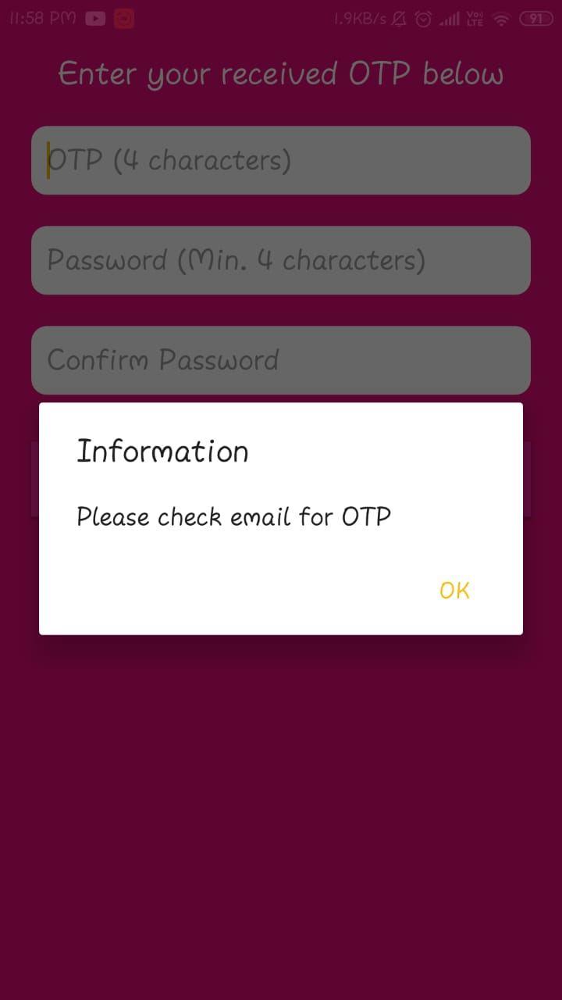

# Food-Ordering-App
An demo app for ordering food

<b>Login Page</b>

<b>SignUp Page</b>

<b>ForgotPassword Page</b>

<b>OTP Page</b>

<b>Navigation Drawer</b>

<b>My Profile Page</b>

<b>Favourite Restaurants Page</b>

<b>Order History Page</b>

<b>FAQ's Page</b>

<b>LogOut Dialog</b>

<b>All Restaurants Page</b>

<b>Restaurants Filter Dialog</b>

<b>Restaurant Dishes Page</b>

<b>Cart Page</b>

<b>Order Successfull Page</b>

